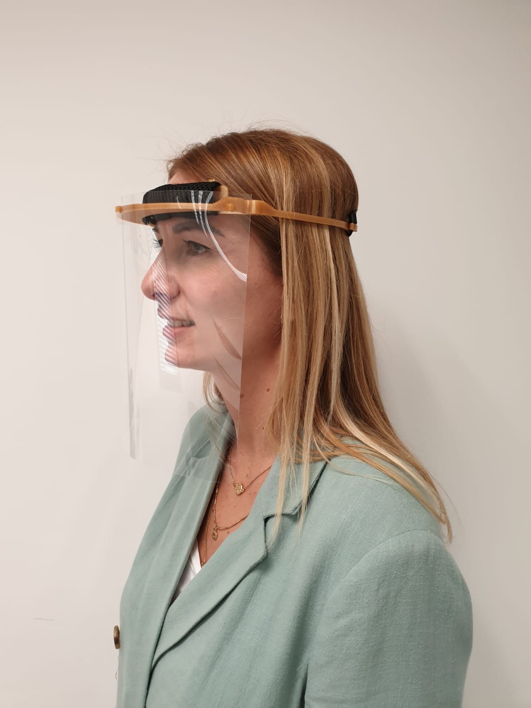

# Covid Task Force
## Masks
* **Fab Lab ULB**

   * Link to info: [https://fablab-ulb.gitlab.io/projects/coronavirus/protective-face-shields/index-en/](https://fablab-ulb.gitlab.io/projects/coronavirus/protective-face-shields/index-en/)
   * Link to file [https://gitlab.com/fablab-ulb/projects/coronavirus/protective-face-shields](https://gitlab.com/fablab-ulb/projects/coronavirus/protective-face-shields)
   * PETG or PLA + transparent A4 sheet (PVC, Acetate...). Time per unit ~30 min
     * Alternative by Andreas Kopp (used in Munich hospital): [https://www.thingiverse.com/thing:4239203](https://www.thingiverse.com/thing:4254884) -> 11 min printing
  

   * Link to file: [https://www.thingiverse.com/thing:4159366](https://www.thingiverse.com/thing:4159366)
   * 3 mm plexiglas + A4 transparent sheet. Time per unit: ~1min
   * Validated by CHU Saint-Pierre Hospital (Brussels)
  

   * Link to files: [https://fablab-ulb.gitlab.io/projects/coronavirus/protective-face-shields/PFC-Headband-Flexible-LaserCut/tuto-en/](https://fablab-ulb.gitlab.io/projects/coronavirus/protective-face-shields/PFC-Headband-Flexible-LaserCut/tuto-en/)
   * Transparent PVC + Priplak (polypropylene) (1mm thick). Time per unit: ~2min/piece
   * Validated by CHU Saint-Pierre Hospital (Brussels)

* **Konrad Klepacki, Mateusz Dyrda**

   * Link to files: [https://hackaday.io/project/170481-laser-cut-medical-shield](https://hackaday.io/project/170481-laser-cut-medical-shield)
   * o,5mm PETG Sheet. Time per unit ~2 mm

* **Stratasys**

Link to file: [Instructions](Masks/Stratasys/ohaad_instructions.pdf)

* **Fab Lab Gregorio Marañón Hospital, Madrid (Validated by the Hospital)**

  * STL file: [https://t.co/JptT0dFNlS?amp=1]
  * Adapted from the model : [https://www.youmagine.com/designs/protective-visor-by-3dverkstan](https://www.youmagine.com/designs/protective-visor-by-3dverkstan)
  * Advantages: No elastic needed, closed on the top, one piece, Acetate A4 holes made with normal punch, Fast impression (0.8mm & 0.6mm)
  * More info (Spanish, TBT: https://twitter.com/3d_maranon/status/1242177410759524355?s=20)
  
* **Basque Country Maker Community**
  * Two different models validated in two different Hospital Areas
  
  
  
  
  
  * Both have similar characteristics (material not important...) and need elastics
  * More info (Spanish): [https://covideuskadi.net/impresion-3d/](https://covideuskadi.net/impresion-3d/)
 
* **Sevilla Fab Lab **
  * Three 3d printed models:
     * Two models take 1h30min 
     * One model take 30-60 min
  * Preferred models (1st and 3rd one):
  
  
  * More info, instructions, links to models (Spanish): [https://docs.google.com/document/d/1ZGGPAnLHep-XhOIiMBEJYYkVxy3LLOOCDgDfDMIugrw/edit] (https://docs.google.com/document/d/1ZGGPAnLHep-XhOIiMBEJYYkVxy3LLOOCDgDfDMIugrw/edit)
  
 ** Raseko / Iceland **
  
   * [https://3dverkstan.se/protective-visor/?fbclid=IwAR2QVHaBhRm0hz_IXHiXDs4B_tChDKYJ-iClWdpPbUc6fW_o_occjZ6r0YA](https://3dverkstan.se/protective-visor/?fbclid=IwAR2QVHaBhRm0hz_IXHiXDs4B_tChDKYJ-iClWdpPbUc6fW_o_occjZ6r0YA)
   
* **Berytech Fab Lab**

  * [File](Masks/Berytech/berytech_mask_ design.dxf) and [mounting instructions](Masks/Berytech/Face_shield_assembly.pdf)
